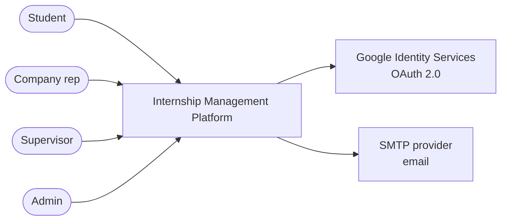
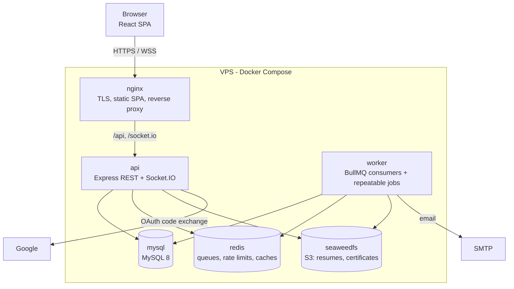
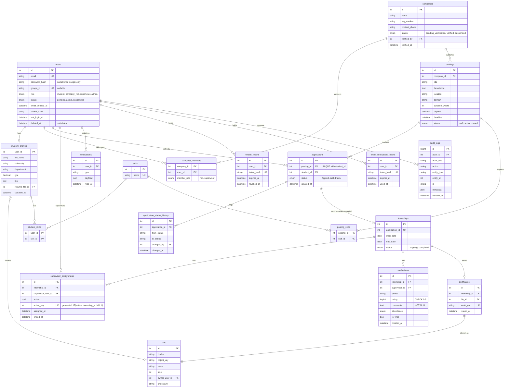
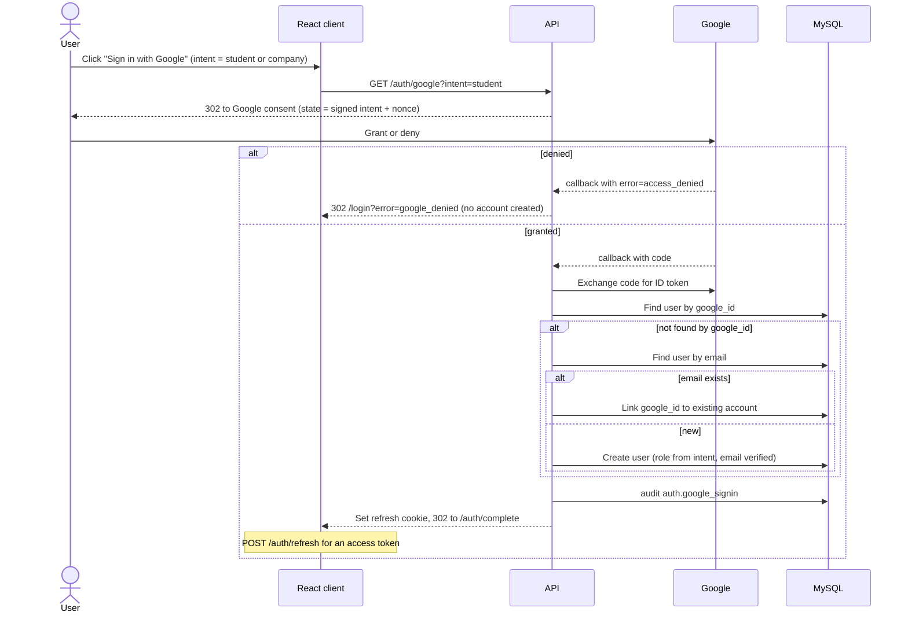
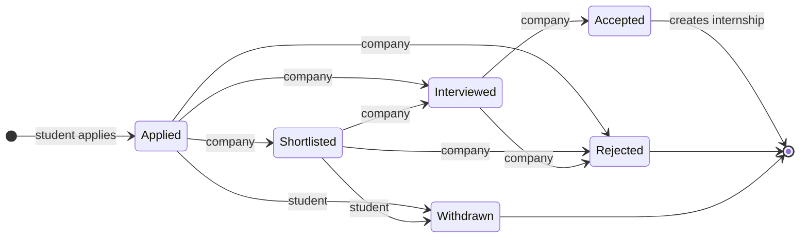
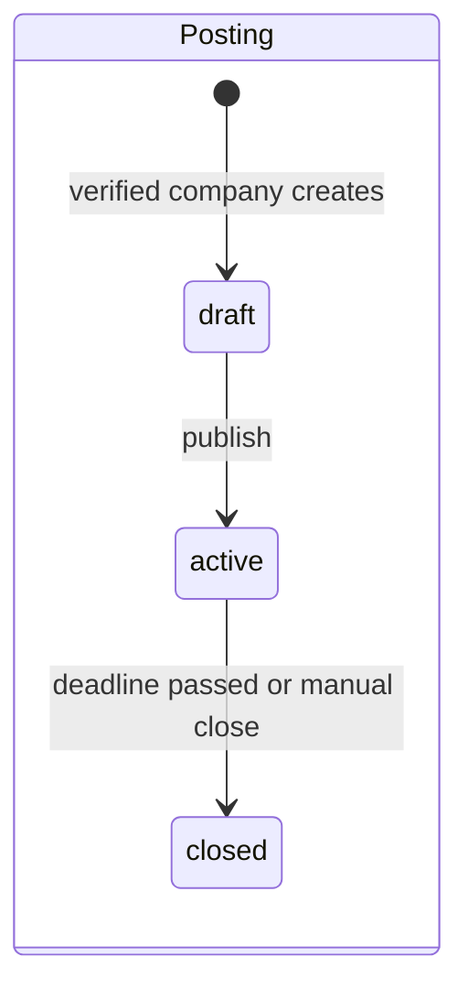
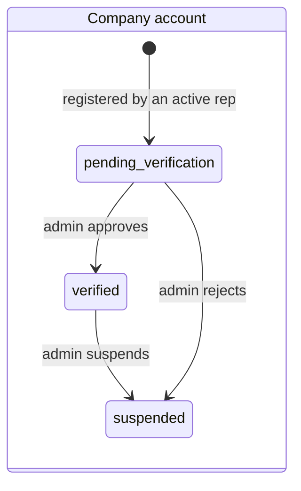
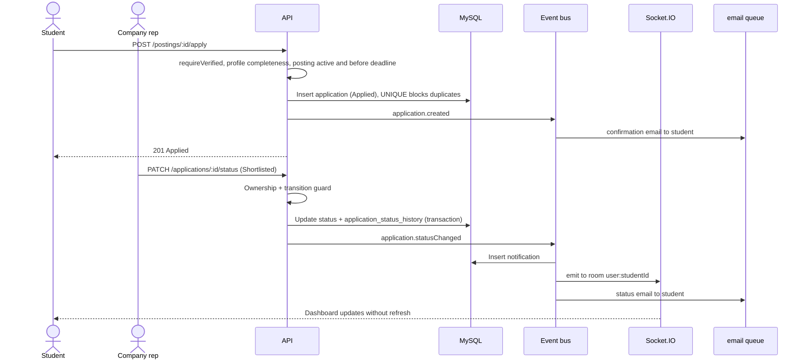
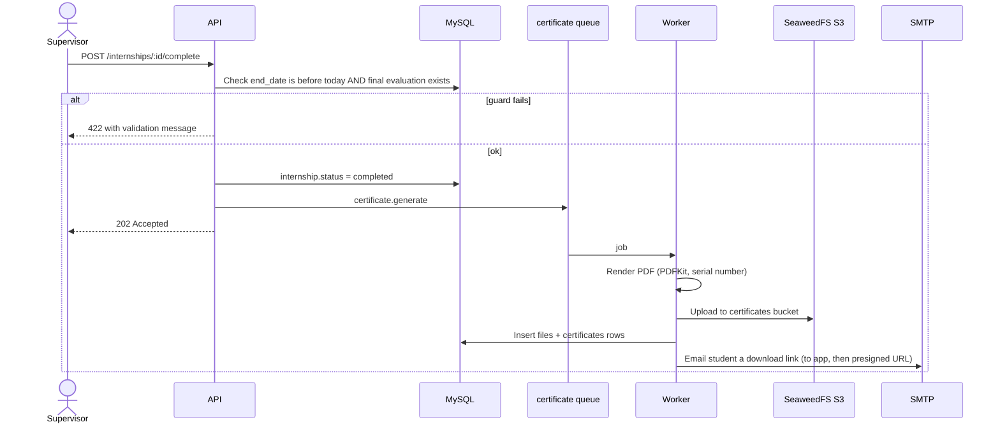

# System Architecture — Internship Management Platform

Requirements come from [ACCEPTANCE.md](../ACCEPTANCE.md). How each story maps to endpoints, tables and jobs is in [TRACEABILITY.md](TRACEABILITY.md).

**Stack:**
- Frontend: React (Vite)
- Backend: Express.js (Node 24)
- Data: Sequelize ORM on MySQL 8
- Supporting services: Redis (BullMQ queues), SeaweedFS (S3-compatible object storage)
- Deployment: Docker Compose on a single VPS behind Nginx
- No SMS: phone verification (US-00B) was dropped on 2026-10-06 because no SMS gateway can be used. Accounts activate through email verification.

---

## 1. Architecture style

The system is a **modular monolith**. One Express codebase is divided into domain modules that match the spec's modules. A separate **worker process**, built from the same codebase and image, handles slow or unreliable work through Redis-backed BullMQ queues: email, PDF generation and scheduled jobs. This keeps API responses inside the 2–3 s performance budget, and failed email deliveries get retried instead of lost. Microservices would add operational cost with no benefit at this scale.

### 1.1 System context



### 1.2 Containers (Docker Compose on one VPS)



| Service | Role | Exposed |
|---|---|---|
| `nginx` | TLS termination (Let's Encrypt via certbot). Serves `client/dist` and proxies `/api` and `/socket.io` | 80, 443 |
| `api` | Express app: REST API and Socket.IO server | internal |
| `worker` | Same image as `api`, entrypoint `node src/worker.js` | internal |
| `mysql` | MySQL 8 on a named volume, with a daily `mysqldump` backup cron | internal |
| `redis` | Redis 7: BullMQ, rate-limit store, Socket.IO adapter, short-lived caches | internal |
| `seaweedfs` | SeaweedFS `weed mini` (pinned 4.47): S3 gateway on 8333 with private buckets `resumes` and `certificates`, access keys from `.env`, and volume data encrypted at rest (`-s3.encryptVolumeData`). Replaced MinIO, which stopped publishing free binaries. The API uses the standard AWS S3 SDK, so any S3-compatible service can replace it | internal |

Configuration is read from `.env`. A committed `.env.example` lists every variable.

---

## 2. Repository layout

```
client/                          React (Vite) SPA
  src/features/                  auth, student, company, supervisor, admin,
                                 postings, applications, notifications
  src/routes/                    role-guarded route trees (one app, four portals)
  src/lib/                       axios instance, socket client, query client
server/
  src/app.js                     express app (middleware + module routers)
  src/server.js                  HTTP + Socket.IO bootstrap
  src/worker.js                  BullMQ workers + repeatable job registration
  src/config/                    env loading and validation
  src/db/{models,migrations,seeders}   sequelize-cli
  src/middleware/                auth, rbac, validate, rateLimit, audit, upload, error
  src/modules/<module>/          routes.js, controller.js, service.js, validators.js
  src/events/                    in-process domain event bus + listeners
  src/jobs/                      queues.js, processors/*, schedules.js
  src/integrations/              email, storage, pdf, google
  tests/{unit,integration}
docker/                          docker-compose.yml, nginx/, backup/
docs/                            ARCHITECTURE.md, TRACEABILITY.md
```

### 2.1 Backend layering

```
routes → validate (Joi) → auth/rbac → controller → service → Sequelize models
                                                     │
                                                     └─ emits domain events → listeners → queue jobs / Socket.IO
```

- **Controllers** only parse the request and shape the response.
- **Services** hold the business rules: state-transition guards, ownership checks, and gating checks. Multi-row changes run inside a Sequelize transaction.
- **Integrations** sit behind adapters (`sendEmail()`, `putObject()`, …). Tests use mocks of these adapters, and switching providers doesn't touch services.

**Backend modules:** `auth`, `users`, `students`, `companies`, `postings`, `applications`, `supervision`, `certificates`, `notifications`, `admin`, `audit`, `files`.

---

## 3. Data model



**Constraints and indexes that enforce requirements:**

| Requirement | Enforcement |
|---|---|
| No duplicate applications (US-03) | `UNIQUE(posting_id, student_id)` on `applications` |
| One active supervisor per intern (US-09) | Generated column `active_key` with a UNIQUE index. A new assignment ends the previous one in the same transaction |
| Rating 1–5, comments and attendance required (US-10) | `CHECK` constraint + `NOT NULL` + Joi validation |
| Search within 2–3 s (US-03) | `FULLTEXT(title, description)` on postings; indexes on `(status, deadline)`, `location`, `domain` |
| Application filters (US-06) | Indexes on `student_profiles(university)` and `(gpa)`, plus the skill join tables |
| Audit is insert-only (US-12) | The DB user for the app gets only `INSERT, SELECT` on `audit_logs` |

---

## 4. Authentication and account security

### 4.1 Sessions
- **Access token:** a JWT (HS256) with a 15-minute lifetime, holding `sub`, `role` and `companyId`. The client keeps it in memory and sends it as `Authorization: Bearer`.
- **Refresh token:** a random 256-bit value with a 7-day lifetime, kept in an `httpOnly; Secure; SameSite=Strict` cookie. It rotates on every `/auth/refresh`, and only its hash is stored in `refresh_tokens`. If an already-rotated token is presented, every token belonging to that user is revoked, since reuse suggests the token was stolen.
- **Passwords:** bcrypt with cost 12. The validator requires at least 8 characters, one digit and one special character (US-01).

### 4.2 Registration and email verification (US-01, US-04)

SMS phone verification (US-00B) was dropped on 2026-10-06: no SMS gateway can be used.

```mermaid
sequenceDiagram
    actor U as User
    participant C as React client
    participant A as API
    participant DB as MySQL
    participant Q as BullMQ email queue
    participant W as Worker

    U->>C: Fill registration form (email, password, phone)
    C->>A: POST /auth/register
    A->>A: Validate password rules, parse phone (libphonenumber-js, E.164; not verified)
    A->>DB: Insert user (status=pending), reject duplicate email
    A->>Q: enqueue email.send (verifyEmail)
    A-->>C: 201 + session (pending)
    Q->>W: job
    W->>U: Email with a single-use link
    U->>A: GET /auth/verify-email/:token
    A->>DB: Set email_verified_at, status=active, audit auth.email_verified
    A-->>U: 302 /login?emailVerified=1
```

- The auth endpoints get a per-IP rate limit through `express-rate-limit` with a Redis store.

**Activation gate:** the middleware `requireVerified` blocks applying and posting until the account is active: for a password account, once its email is verified; a Google account is active from the start.

Company reps also need `companies.status = verified` before they can post.

### 4.3 Sign in with Google (US-00A)



Google accounts get the same RBAC as password accounts and are active at once, since Google has verified the email. The OAuth scope is limited to `openid email profile`.

**Implementation notes:**
- The flow is implemented directly in `server/src/integrations/google.js` with `fetch`, rather than with Passport, because Passport's OAuth `state` check needs server-side sessions and this API is stateless.
- The `state` is a short-lived signed JWT. It carries the intent and a nonce, and the nonce must match an httpOnly `SameSite=Lax` cookie.
- Accounts are linked by email only when Google reports the email as verified.
- Linking to an account whose email was never verified clears that account's password and revokes its sessions. This blocks pre-registration takeover.
- Every failure redirects to `/login?error=<code>`. The codes are `google_denied`, `google_failed`, `google_email_unverified`, `google_unavailable` and `account_suspended`.

### 4.4 Authorization
- `authenticate` checks the JWT, then loads the user's status from a Redis cache (30 s TTL, invalidated on change). If the account is suspended it returns **403 immediately**, which satisfies the US-12 requirement that suspension take effect at once.
- `authorize(...roles)` checks the user's role.
- Services check ownership:
  - A company rep can access only their company's postings and applicants.
  - A supervisor can access only interns with an active assignment to them.
  - A student can access only their own applications and evaluations.

### 4.5 File handling
- Uploads go through Multer with memory storage and a 5 MB limit.
- The `file-type` magic-byte check accepts only PDF and DOCX, whatever the declared MIME type.
- Files are written to SeaweedFS through the S3 API (encrypted at rest), and a row is recorded in `files`.
- Downloads are served only as presigned URLs that expire after 5 minutes, issued after an authorization check.
- Local development may use Cloudflare R2 instead of SeaweedFS (`S3_ENDPOINT`, `S3_REGION=auto`); R2 encrypts every object at rest.

---

## 5. Application workflow

### 5.1 State machines







A single transition table in `applications/service.js` drives both the guards and the UI. `GET /applications/:id` returns the actions that are allowed next, so the client can disable **Withdraw** once an application is Accepted or Rejected (US-08).

### 5.2 Apply and status change → notification



**Real-time delivery (US-07):**
- Once authenticated, each socket joins the room `user:<id>`.
- Socket.IO uses the Redis adapter, so the api and worker processes can both emit.
- The client handles `notification` events by invalidating the relevant TanStack Query keys.
- If the socket is disconnected, the data refreshes on the next page load.

---

## 6. Supervision and certificates

**Assigning a supervisor (US-09):**
- `POST /internships/:id/supervisor` requires that the supervisor is a `company_members` row with `member_role = supervisor` in the same company.
- One transaction ends the previous active assignment and inserts the new one.
- Both the supervisor and the student are notified.

**Evaluations (US-10):**
- Only the active supervisor can create one.
- Evaluations are immutable once saved.
- The student and the company rep can read them. For the student they are read-only.

**Certificates (US-11):**



---

## 7. Background jobs

| Queue / job | Trigger | Behaviour | Story |
|---|---|---|---|
| `email.send` | Domain events | Verification, confirmations, status changes, certificate link (Nodemailer SMTP) | US-01, US-03, US-06, US-07, US-08, US-09, US-11 |
| `certificate.generate` | Supervisor confirms completion | PDFKit → S3 → email | US-11 |
| `postings.autoClose` | Repeatable, every 5 min | Changes `active` postings whose deadline has passed to `closed` | US-05 |
| `internships.markEnded` | Repeatable, daily | Flags internships past their end date as awaiting a final evaluation | US-11 |
| `maintenance.cleanup` | Repeatable, daily | Purges expired verification tokens, invites and refresh tokens | Security |

The API also refuses applications after a posting's deadline, so no application gets through between cron runs.

---

## 8. API surface (REST, prefix `/api/v1`)

| Module | Endpoints |
|---|---|
| auth | `POST /auth/register`, `POST /auth/login`, `POST /auth/refresh`, `POST /auth/logout`, `GET /auth/me`, `GET /auth/google`, `GET /auth/google/callback`, `GET /auth/verify-email/:token`, `POST /auth/verify-email/resend`, `GET /auth/invite/:token`, `POST /auth/invite/accept` |
| students | `GET /students/me`, `PUT /students/me`, `POST /students/me/resume`, `GET /students/me/resume` (presigned link), `DELETE /students/me/resume` |
| companies | `POST /companies`, `GET /companies/me`, `GET /companies/me/staff`, `POST /companies/me/staff`, `POST /companies/me/staff/:userId/invite` |
| postings | `GET /postings?q&location&domain&page&limit` (public), `GET /postings/:id`, `GET /companies/me/postings`, `POST /postings`, `PUT /postings/:id`, `POST /postings/:id/publish`, `POST /postings/:id/close` |
| applications | `POST /postings/:id/apply`, `GET /applications/me`, `GET /applications/:id`, `POST /applications/:id/withdraw`, `GET /postings/:id/applications?skills&university&minGpa`, `PATCH /applications/:id/status`, `GET /applications/:id/resume` (presigned link for the posting's company) |
| supervision | `GET /internships` (role-aware: own, company's, or the supervisor's current interns), `GET /internships/:id`, `PATCH /internships/:id/dates`, `POST /internships/:id/supervisor`, `GET`/`POST /internships/:id/evaluations`, `GET /internships/:id/resume`. Accepting an application (`PATCH /applications/:id/status`, optional `startDate`) creates the internship |
| certificates | `POST /internships/:id/complete`, `GET /certificates/:id/download` |
| notifications | `GET /notifications`, `PATCH /notifications/:id/read` |
| admin | `GET /admin/stats`, `GET /admin/users?q&role&status`, `POST /admin/users/:id/suspend`, `POST /admin/users/:id/reinstate`, `DELETE /admin/users/:id`, `GET /admin/companies?status=`, `POST /admin/companies/:id/approve`, `POST /admin/companies/:id/suspend`, `POST /admin/companies/:id/reinstate`, `GET /admin/audit-logs` |
| account | `GET /account/export` (data download), `POST /account/delete` (erasure by anonymisation), `GET /account/privacy-info` (public: retention periods, contact) |
| system | `GET /health` |

**Conventions:**
- Lists are paginated with `?page=&limit=` and respond with `{ data, meta: { page, limit, total } }`.
- Every error uses one shape: `{ error: { code, message, fields? } }`.
- Validation failures return 422, authorization failures 403, and failed state-transition guards 409.

---

## 9. Frontend

- **Structure:** one SPA with React Router, a `RequireAuth` guard, a `RequireRole(role)` guard, and four layouts (student, company, supervisor, admin). The layout and navigation follow the role stored in the token.
- **Data:**
  - TanStack Query handles server state.
  - An Axios instance attaches the access token. On a 401 it silently calls `/auth/refresh` once and retries.
  - `socket.io-client` connects after login.
- **Forms:** React Hook Form + Zod. The schemas mirror the server-side Joi rules for password, phone, profile and evaluation fields, and missing mandatory fields are highlighted (US-02).
- **UI:** mobile-first responsive layout. The component library is chosen during implementation.

---

## 10. Cross-cutting concerns

- **Audit (US-12, NFR):** `auditService.log()` records every admin action (approve, suspend, reinstate, delete) and every auth event (login, logout, failed login, email verified, Google sign-in or link). Each entry stores the actor ID, role, IP and timestamp. Admins can read the log in the dashboard.
- **Logging:** `pino` + `pino-http` structured JSON logs with a `requestId` on every request. Secrets and tokens are never logged.
- **Health and monitoring:** `/api/v1/health` checks MySQL, Redis and S3 storage (a signed HeadBucket on the resumes bucket, so bad credentials or a missing bucket also show as down; HeadBucket because an R2 token scoped to specific buckets cannot list them all), and Docker healthchecks call it. Queue metrics are exposed to the admin dashboard.
- **Admin stats:** COUNT queries over indexed status columns, cached in Redis for 60 s.
- **Security hardening:** `helmet`, CORS restricted to the app's own origin, body size limits, Sequelize parameterized queries only, and Redis-backed rate limits.
- **Data protection:**
  - Data is encrypted at rest (SeaweedFS volume encryption and VPS disk encryption) and in transit (TLS).
  - Personal data is collected minimally.
  - A delete request soft-deletes the user and anonymizes their personal data.
  - Backups are encrypted and rotated (7 daily + 4 weekly).
- **Configuration:** `src/config` validates every environment variable at startup, so the app fails fast if one is missing. Secrets live only in `.env` on the VPS.

---

## 11. Testing strategy

| Layer | Tooling | Scope |
|---|---|---|
| Server unit | Vitest | Services, state machine tables, validators |
| Server integration | Vitest + Supertest + MySQL/Redis test containers | Endpoints end-to-end, including DB constraints |
| Integrations | Adapter mocks | Email, storage, Google |
| Client | Vitest + React Testing Library | Forms, guards, status UI |

Test names cite the story ID and criterion, e.g. `US-08: withdraw disabled when Accepted`.

---

## 12. Deployment

- **Server:** a single Ubuntu VPS running Docker Engine + Compose.
- **Deploy:** `git pull && docker compose build && docker compose up -d`. Migrations run on `api` startup through `sequelize-cli db:migrate`.
- **TLS:** certbot renews the certificates, and nginx reloads on renewal.
- **Backups:** nightly `mysqldump` and an S3 bucket sync, encrypted and copied off-server.
- **Scaling path if needed later:**
  - Run more `api` and `worker` replicas. This needs no code changes, because sessions are stateless JWTs and the Socket.IO adapter is on Redis.
  - Move MySQL and object storage to managed services.

---

## 13. Implementation roadmap

1. Scaffold the monorepo, Docker Compose, config validation, Sequelize setup and migrations, the health endpoint, and CI lint and test.
2. Auth: register, login, JWT + refresh rotation, email verification, Google OAuth, audit logging. (SMS OTP was planned here and dropped.)
3. Student profile and resume upload. Company registration with admin approval.
4. Postings (CRUD, publish, search, auto-close) and applications (apply, status transitions, withdraw, filters).
5. Notifications: event bus, Socket.IO, and email.
6. Supervision: internships, supervisor assignment, evaluations, certificate generation.
7. Admin dashboard, suspension, and the audit log viewer. Then hardening, backups, and deployment to the VPS.
